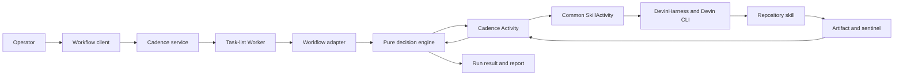

# Orchestration: Analysis and Design

This guide explains how the repository durably coordinates agentic calls through the Analysis and Design phases of the SDLC, how to operate the examples, and where to extend them.

It documents this repository's implementation rather than replacing the official [Cadence documentation](https://cadenceworkflow.io/docs/) or Devin documentation.

## Contents

- [What orchestration means here](#what-orchestration-means-here)
- [Quick start](#quick-start)
- [Implemented workflows](#implemented-workflows)
- [End-to-end execution path](#end-to-end-execution-path)
- [Architecture and responsibilities](#architecture-and-responsibilities)
- [Artifacts and observability](#artifacts-and-observability)
- [Failure handling and human intervention](#failure-handling-and-human-intervention)
- [Configuration](#configuration)
- [Extending the orchestration](#extending-the-orchestration)
- [Troubleshooting](#troubleshooting)
- [Implementation reference](#implementation-reference)

## What orchestration means here

An agent can perform a single task from one prompt. Orchestration turns several such tasks into a controlled process with explicit order, inputs, outputs, retries, validation, and terminal states.

This repository uses Cadence to make that process durable:

- a **Workflow** records deterministic sequencing and decisions;
- an **Activity** performs a side effect such as reading a file, running Devin, or publishing an artifact;
- a **Worker** hosts Workflow and Activity implementations and polls a task list;
- the **Cadence service** stores execution history, timers, and state;
- a **client** starts, queries, or signals an execution.

The distinction matters because Cadence may replay Workflow code to recover state. Workflow code therefore coordinates work but does not invoke models, access files, start subprocesses, use wall-clock time, or perform network I/O directly. Those operations belong in retry-safe Activities.

## Quick start

Run all commands from the repository root.

### 1. Prepare the environment

```bash
nix-shell --run "python3 -m venv .venv && .venv/bin/pip install -r src/orchestrator/requirements.txt"
devin auth status
```

The runtime also requires Docker with Docker Compose and an authenticated Devin CLI.

### 2. Start Cadence and the Workers

```bash
scripts/start-workflow-engine.sh
```

The script:

1. validates local prerequisites and Devin authentication;
2. inspects the configured workflow catalog;
3. starts Cadence and Cadence Web with Docker Compose;
4. registers each configured Cadence domain;
5. starts the orchestrator Worker process; and
6. waits until every configured domain/task-list route is polling.

Cadence Web is available at <http://localhost:8088>. Worker startup output is written to `scripts/.run/worker.log`.

### 3. Run Story Analysis

```bash
scripts/kickoff-analyze-story.sh docs/ex/example_story.md
```

The command prints a `workflow_id` and `run_id`. Query the current run with:

```bash
nix-shell --run "PYTHONPATH=src .venv/bin/python -m story_analysis_workflow.cli query <workflow_id>"
```

If the run is waiting for human input, send one of `retry`, `accept`, or `abort`:

```bash
nix-shell --run "PYTHONPATH=src .venv/bin/python -m story_analysis_workflow.cli signal <workflow_id> retry --notes 'Run the analysis again'"
```

Use the independent evaluator after a consolidated Analysis report exists:

```bash
nix-shell --run ".venv/bin/python scripts/evaluate-story-analysis.py docs/ex"
```

### 4. Run Story Design

Pass a successful Analysis artifact to Design:

```bash
scripts/kickoff-design-story.sh docs/ex/example_story.analysis.json
```

The Design client prints its execution identifiers. Follow the execution in Cadence Web and inspect the artifacts written beside the input analysis.

The kickoff commands are separate on purpose: the current repository demonstrates both workflow modules and their artifact handoff, but does not provide a parent pipeline workflow that automatically starts Design when Analysis finishes.

### 5. Stop the local engine

```bash
scripts/stop-workflow-engine.sh
```

## Implemented workflows

### Story Analysis

`StoryAnalysisWorkflow` turns a Markdown story into a graded analysis and a consolidated report.

```text
Validate story
    -> Extract structured intent
    -> Analyze story
    -> Grade analysis
         | pass
         v
       Publish report
         |
         | fail with attempts remaining
         +-----------------------> Analyze again
         |
         | attempts exhausted
         v
       Wait for human retry / accept / abort
```

The Workflow:

1. validates that the source is an acceptable Markdown document;
2. invokes `extract-story-intent`;
3. invokes `analyze-story`;
4. invokes `grade-story-analysis`;
5. repeats analysis and grading when the quality gate fails and attempts remain;
6. waits durably for a bounded human decision after automated attempts are exhausted; and
7. publishes a consolidated run report for modeled terminal outcomes.

Analysis exposes a `get_status` Query and a `human_response` Signal. It is the richer example when studying retries, durable waiting, and human-in-the-loop control.

### Story Design

`StoryDesignWorkflow` consumes an Analysis JSON artifact and produces implementation design material.

```text
Validate analysis source
    -> Audit current repository reality
    -> Validate audit handoff
    -> Design implementation
    -> Validate design handoff
    -> Grade design
         | pass
         v
       Draft implementation plan
    -> Validate plan handoff
    -> Publish report
```

The Workflow:

1. validates the incoming Analysis document;
2. invokes `audit-current-reality` against the repository;
3. validates the audit against its schema;
4. invokes `design-story-implementation` with both Analysis and audit artifacts;
5. validates and grades the design;
6. drafts and validates an implementation plan after the quality gate passes; and
7. publishes a Design report.

Design currently terminates when an Activity fails, a handoff is invalid, or the design grade fails. It does not implement the Analysis workflow's human-signal loop.

## End-to-end execution path

The same execution model supports both workflow modules:

1. An operator starts the local engine.
2. `orchestrator.worker` loads `src/orchestrator/workflow_catalog.json`.
3. Each catalog entry imports a workflow module that declares its domain, task list, Workflow wire names, Activity wire names, and registration callback.
4. The orchestrator groups modules by route and creates a Cadence Worker for each domain/task-list pair.
5. A kickoff script resolves the source path and calls the workflow package's Python CLI.
6. The client starts a named Workflow execution and prints its identifiers.
7. Cadence persists the execution and routes tasks to the compatible Worker.
8. A thin Cadence Workflow adapter delegates sequencing and decisions to its workflow package's pure engine.
9. The Workflow schedules named Activities with timeout and retry policies.
10. Validation Activities check local preconditions and schema handoffs.
11. Skill Activities use the shared `SkillActivity` lifecycle and `DevinHarness` to invoke the corresponding repository skill through the Devin CLI.
12. Skills write structured artifacts and completion sentinels; Activity results return artifact paths to the Workflow.
13. The Workflow passes those paths to subsequent Activities and eventually publishes a report.
14. Operators inspect Cadence history, local logs, reports, and generated artifacts as the run's paper trail.



## Architecture and responsibilities

### Common infrastructure

`src/common/` contains workflow-independent mechanisms:

- immutable workflow module and Worker contracts;
- the generic `SkillActivity` lifecycle;
- Harness and `DevinHarness` abstractions;
- invocation context and ATIF usage extraction; and
- workflow-aware logging support.

This layer does not own Analysis or Design decisions.

### Workflow packages

`src/story_analysis_workflow/` and `src/story_design_workflow/` each own:

- a pure asynchronous decision engine;
- a thin Cadence Workflow adapter;
- concrete validation and skill Activities;
- Activity-specific JSON configuration;
- Workflow and Activity registration metadata;
- client configuration, starter, and CLI;
- artifact contracts and reporting; and
- unit tests.

A workflow package imports common infrastructure but does not depend on the orchestrator or the other business workflow.

### Orchestrator composition root

`src/orchestrator/` owns application composition rather than business logic. It:

- loads configured module paths;
- validates workflow descriptors and registration conflicts;
- groups modules by domain and task list;
- builds route-specific registries;
- manages Cadence clients and Workers transactionally; and
- exposes catalog inspection for startup scripts and diagnostics.

This boundary allows another workflow package to be added without modifying Analysis or Design behavior.

### Agentic Activity boundary

A concrete skill Activity translates between two identities:

| Identity | Example | Purpose |
|---|---|---|
| Cadence Activity name | `analyze_story` | Stable wire name used in Workflow code and Cadence history |
| Devin skill name | `analyze-story` | Repository capability invoked by the harness |

The Activity constructs the skill prompt, supplies adjacent harness configuration, clears stale completion state, invokes Devin outside the Workflow replay boundary, verifies the sentinel/output contract, and returns a serializable result.

## Artifacts and observability

The generated files are the primary developer-facing paper trail. Exact names are determined by each skill's output contract, but a successful Analysis-to-Design exploration typically includes:

- structured intent JSON;
- story analysis JSON;
- analysis grade JSON;
- consolidated Analysis report JSON;
- current-reality audit JSON;
- implementation design JSON;
- design grade JSON;
- implementation plan JSON;
- Design report JSON; and
- completion sentinels under a nearby `.process/` directory.

### Where to observe a run

| Source | What it shows |
|---|---|
| Cadence Web at `localhost:8088` | Workflow state, Activity attempts, failures, timers, and event history |
| `scripts/.run/worker.log` | Worker startup, routing, and runtime failures |
| `.process/logs/` below the artifact chain | Workflow, Activity, and Devin invocation evidence |
| Generated JSON artifacts | The content passed between Analysis and Design steps |
| Consolidated reports | Terminal outcome, artifact references, attempt observations, and available usage data |
| Analysis evaluator output | Independent checks of reports, schemas, paths, and sentinels |

Do not treat a generated artifact as valid merely because it exists. Follow the Workflow's validation/grade state or run the available evaluator.

## Failure handling and human intervention

### Activity retries

Both Workflow adapters schedule Activities with:

- a 30-minute start-to-close timeout;
- up to three attempts;
- an initial five-second retry interval;
- exponential backoff; and
- a maximum five-minute retry interval.

These retries address execution failures such as a failed Devin invocation or malformed/missing completion evidence. Artifact-producing Activities must therefore be safe to run more than once.

### Quality gates

Execution success and output quality are different concerns:

- Cadence retries an Activity that fails to execute successfully.
- A grader evaluates an artifact that was produced successfully.
- Analysis may repeat its analysis/grade quality loop.
- Design proceeds to planning only after its design grade passes.
- Schema handoff validation prevents malformed upstream artifacts from reaching downstream skills.

### Analysis human response

After Analysis exhausts automated quality attempts or Activity recovery, it can wait for:

- `retry` — run the relevant automated work again;
- `accept` — retain the current result and finish as human-resolved; or
- `abort` — stop as failed.

The wait uses Cadence-managed state and timers rather than an in-process sleep, so normal Worker restarts do not discard the orchestration decision.

## Configuration

### Workflow catalog

`src/orchestrator/workflow_catalog.json` is the composition root's source of enabled modules:

```json
{
  "version": 1,
  "workflow_modules": [
    "story_analysis_workflow.module",
    "story_design_workflow.module"
  ]
}
```

Inspect the resolved topology without starting Workers:

```bash
nix-shell --run "PYTHONPATH=src .venv/bin/python -m orchestrator.worker inspect-catalog"
```

### Workflow client configuration

Each workflow package owns its domain, task-list, target, and timeout defaults in a colocated `domain-task-list-retry-config.json`. The client loaders also support explicit arguments and environment overrides.

The included modules use separate routes:

| Module | Domain | Task list |
|---|---|---|
| Story Analysis | `story-analysis` | `story-analysis` |
| Story Design | `story-design` | `story-design` |

### Activity configuration

Harness-backed Activities keep same-stem `*.config.json` files beside their Python adapters. Configuration is namespaced so Activity behavior and harness-specific Devin options remain colocated with the step they affect.

Restart the Worker after changing Worker-lifetime configuration.

## Extending the orchestration

### Add a skill-backed Activity

1. Create or identify a repository skill with explicit input, output, schema, and sentinel contracts.
2. Add an Activity adapter inside the owning workflow package's `activities/` directory.
3. Give the Activity a stable Cadence wire name and map it to the canonical skill name.
4. Add adjacent Activity/harness configuration when the shared defaults are insufficient.
5. Register the Activity in the workflow package's `module.py`.
6. Add an injected callable to the pure engine and schedule it from the Cadence adapter.
7. Test prompt construction, output resolution, stale/missing sentinels, retries, and serialization.
8. Run the Activity through local Cadence to verify real routing and logs.

### Add a workflow module

Use the existing Analysis and Design packages as structural examples, not as base classes:

1. Define stable, serializable input and result contracts.
2. Put sequencing and branching in a Cadence-independent asynchronous engine.
3. Add a thin Workflow adapter that maps engine ports to Activities, durable timers, Signals, or Queries.
4. Keep all side effects in Activities and make them idempotent.
5. Create a `WorkflowModuleSpec` with the module's name, domain, task list, wire types, and registration callback.
6. Add colocated client configuration, starter code, and an operator-facing CLI or script.
7. Add the module path to `src/orchestrator/workflow_catalog.json`.
8. Test engine branches, Activity adapters, module registration, client behavior, and live local execution.

Choose domain and task-list boundaries deliberately. Separate task lists provide routing and operational isolation; shared task lists require every polling Worker to register compatible implementations.

### Connect Analysis to another phase

Keep business workflow packages independent. Pass artifact references through stable contracts and place sequencing ownership at a higher level.

Two common approaches are:

- **Durable coordinator Workflow:** starts child workflows and records the whole pipeline in Cadence history. Prefer this when the cross-phase process itself must survive failures and long waits.
- **External coordinator:** a service or client persists progress, validates one workflow's result, and starts the next through its public client API. Prefer this when workflows deploy independently or pipeline definitions change frequently.

A shell script can demonstrate a handoff locally, but production coordination needs durable progress and idempotency rather than an unrecorded sequence of commands.

### Preserve these invariants

- Workflow code remains deterministic and side-effect free.
- Activities are safe to retry.
- Workflow and Activity wire names remain stable for running histories.
- Workflow packages do not import one another.
- The orchestrator composes modules but does not own business sequencing.
- Every artifact handoff is explicit and validated.
- Logs and reports contain identifiers and paths, never secrets.

## Troubleshooting

### The engine does not become ready

Inspect:

```bash
cat scripts/.run/worker.log
```

Then verify Docker, the virtual environment, `nix-shell`, Devin installation, and Devin authentication. The startup script fails if a configured Worker route never begins polling.

### A workflow appears stuck

1. Find the execution in Cadence Web.
2. Inspect its event history and current Activity attempt.
3. For Analysis, run the status Query and check whether it awaits a human response.
4. Inspect `scripts/.run/worker.log` and the run's `.process/logs/` hierarchy.
5. Check the latest sentinel and artifact before deciding to retry.

### An Activity repeatedly fails

Check, in order:

1. the Activity failure in Cadence history;
2. the Worker and per-Activity logs;
3. Devin authentication and permission mode;
4. the Activity's adjacent configuration;
5. the skill's expected input path, output schema, and sentinel contract; and
6. whether a retry is encountering stale or non-idempotent artifact state.

### Design does not start automatically

This is expected. Analysis and Design are independently startable workflow modules. Start Design with `scripts/kickoff-design-story.sh` after selecting a successful Analysis artifact, or implement a durable/external coordinator as described above.

### Generated output is present but the run failed

An Activity can write a file that later fails schema validation or grading. Use the Workflow terminal state, consolidated report, Cadence history, and evaluator results rather than file presence alone.

## Implementation reference

| Concern | Location |
|---|---|
| Engine startup and shutdown | `scripts/start-workflow-engine.sh`, `scripts/stop-workflow-engine.sh` |
| Workflow catalog | `src/orchestrator/workflow_catalog.json` |
| Catalog loading and composition | `src/orchestrator/catalog.py`, `src/orchestrator/composition.py` |
| Worker lifecycle | `src/orchestrator/worker.py`, `src/orchestrator/runtime.py` |
| Common Activity/harness boundary | `src/common/skill_activity.py`, `src/common/devin_harness.py` |
| Analysis kickoff and client | `scripts/kickoff-analyze-story.sh`, `src/story_analysis_workflow/cli.py`, `starter.py` |
| Analysis sequencing | `src/story_analysis_workflow/story_analysis_engine.py`, `workflow.py` |
| Analysis Activities | `src/story_analysis_workflow/activities/` |
| Analysis evaluation | `scripts/evaluate-story-analysis.py` |
| Design kickoff and client | `scripts/kickoff-design-story.sh`, `src/story_design_workflow/cli.py`, `starter.py` |
| Design sequencing | `src/story_design_workflow/design_engine.py`, `workflow.py` |
| Design Activities | `src/story_design_workflow/activities/` |
| Architecture decisions | `vault/decisions/ADR-013-three-layer-workflow-module-architecture.md`, `ADR-014-colocated-skill-activity-template-method.md` |

When exploring an unfamiliar step, begin with its workflow engine to understand the decision path, then follow the injected callable into `workflow.py`, the concrete Activity, its adjacent configuration, and finally the invoked skill contract.
